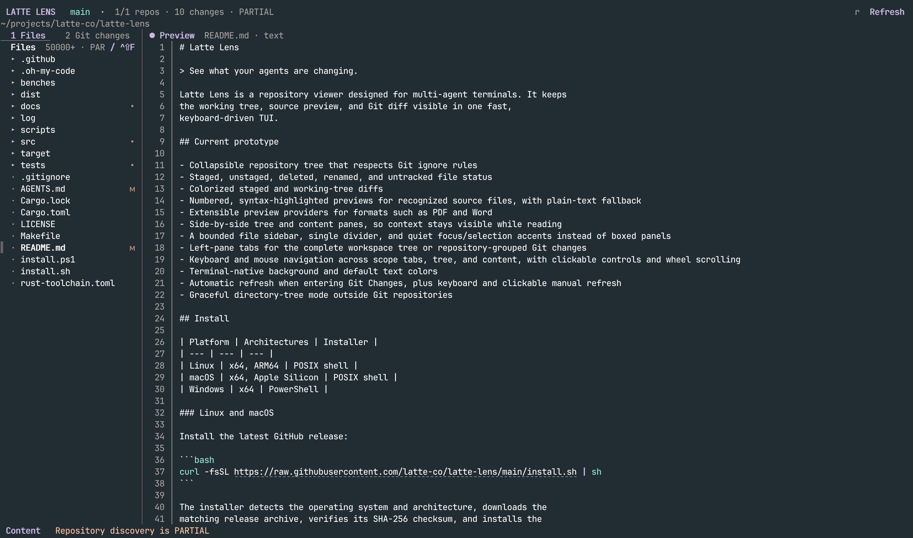

# Latte Lens

> See what your agents are changing.

Latte Lens is a repository viewer designed for multi-agent terminals. It keeps
the working tree, source preview, and Git diff visible in one fast,
keyboard-driven TUI.



## Current prototype

- Collapsible, bounded workspace tree with lazy directory loading
- Staged, unstaged, deleted, renamed, and untracked file status
- Colorized staged and working-tree diffs with old/new line numbers and emphasized additions/deletions
- Per-file added/deleted line counts and review markers that become stale when the diff changes
- Numbered, syntax-highlighted previews for recognized source files, with plain-text fallback
- Extensible preview providers for formats such as PDF and Word
- Side-by-side tree and content panes, so context stays visible while reading
- A bounded file sidebar, single divider, and quiet focus/selection accents instead of boxed panels
- Left-pane tabs for the complete workspace tree or repository-grouped Git changes
- IDEA-style file and workspace search popups that preserve each query, result list, and selection while hidden
- Keyboard and mouse navigation across scope tabs, tree, and content, with clickable controls and wheel scrolling
- Terminal-native background and default text colors
- Automatic refresh when entering Git Changes, plus keyboard and clickable manual refresh
- Graceful directory-tree mode outside Git repositories

## Install

| Platform | Architectures | Installer |
| --- | --- | --- |
| Linux | x64, ARM64 | POSIX shell |
| macOS | x64, Apple Silicon | POSIX shell |
| Windows | x64 | PowerShell |

### Linux and macOS

Install the latest GitHub release:

```bash
curl -fsSL https://raw.githubusercontent.com/latte-co/latte-lens/main/install.sh | sh
```

The installer detects the operating system and architecture, downloads the
matching release archive, verifies its SHA-256 checksum, and installs the
binary to `~/.local/bin`. Until the first stable release exists, it falls back
to the newest preview and prints a warning.

### Windows

Run this from PowerShell:

```powershell
irm https://raw.githubusercontent.com/latte-co/latte-lens/main/install.ps1 | iex
latte-lens C:\path\to\repository
```

The PowerShell installer downloads and verifies the Windows x64 package,
installs it to `%LOCALAPPDATA%\Programs\latte-lens\bin`, and adds that directory
to the current user's `PATH`. Open a new terminal if `latte-lens` is not yet
available in the current session.

Pin a release or change the destination before running the installer:

```powershell
$env:LATTE_LENS_VERSION = "v0.1.0-beta.5"
$env:LATTE_LENS_INSTALL_DIR = "C:\Tools\latte-lens"
irm https://raw.githubusercontent.com/latte-co/latte-lens/main/install.ps1 | iex
```

## Run it

Build and run directly from a checkout:

```bash
cargo run -- /path/to/repository
```

Install the command from this checkout, then run it from anywhere:

```bash
make install
latte-lens /path/to/repository
```

By default, Cargo installs `latte-lens` into `~/.cargo/bin`.

Inside the TUI:

| Key | Action |
| --- | --- |
| `↑` / `↓` | Move the focused tree or scroll focused content; `↑` at the first/empty tree row focuses scope tabs |
| `←` / `→` | Focus Tree or Content; while scope tabs are focused, select All Files or refresh/select Git Changes |
| `shift-←` / `shift-→` | Scroll Diff/Info horizontally; Preview wraps automatically |
| `j` / `k` | Move in the focused tree, or scroll the focused content pane |
| `1` / `2` | Show all files, or refresh and show only Git changes, while retaining focus |
| `tab` / `shift-tab` | Switch the left tree scope while retaining focus |
| `h` / `l` | Focus the tree or content pane |
| `enter` | Expand/collapse the selected repository/directory, or focus Content for a selected file/pointer diff |
| `/` / `ctrl-p` | Open the file popup |
| `ctrl-f` | Find in the current Preview or Diff |
| `f12` / `shift-f12` / `ctrl-f12` | In focused Preview content, find the definition, references, or implementations through an explicitly configured language server |
| `@` | Open bounded local document symbols for the current Preview |
| `alt-←` / `alt-→` | Move backward or forward through successful navigation locations |
| `[` / `]` | In focused Preview content, jump to the previous or next visible fold marker |
| `enter` / `space` | In focused Preview content, toggle the fold at the current marker |
| `{` / `}` | In focused Preview content, collapse or expand all folds |
| `ctrl-shift-f` / `ctrl-t` | Open the workspace text-search popup; `ctrl-t` works in terminals that cannot distinguish `ctrl-shift-f` from `ctrl-f` |
| `p` / `d` | Show Preview or Diff in the right pane |
| `space` | Mark the displayed file diff reviewed; press again to clear the mark |
| `n` / `N` | Next or previous changed file in Diff |
| `ctrl-d` / `ctrl-u` | Page through content |
| `r` | Refresh repository state |
| `q` / `esc` | Press twice within 1.5 seconds to quit; `esc` closes an active search first |
| `ctrl-c` | Quit immediately when no content is selected; copy the current selection otherwise |

Mouse controls:

- Click `Files` or `Git changes` to switch the left tree dataset; entering Git Changes refreshes it first.
- Click `Refresh` in the header (or press `r`) to re-scan the repository without leaving the current view.
- Click `Open` or `Text` in the Files heading to open file or workspace text search. Search uses a centered popup whose width is independent of the Files pane; text matches show their path and source line separately.
- In the popup, type directly, use `↑`/`↓` to preview results, and press `Enter` to open one. `Esc`, the close button, and opening a result hide the popup without clearing its query, results, selection, or scroll position. Reopening File or Text search restores that mode's previous session.
- Press `Ctrl+U` or click `Clear` to explicitly clear the current search. `Ctrl+P` switches to the saved file-search session and `Ctrl+Shift+F` or `Ctrl+T` switches to the saved workspace-text session. Text search keeps `F2` for case sensitivity, `F3` for whole words, `F4` for regular expressions, and `F5` for ignored content.
- In a Preview or Diff, `Ctrl+F` opens an in-content find bar. `Enter`/`↓` and `Shift+Enter`/`↑` move between matches, `F2` toggles case sensitivity, and `Esc` closes it. The same controls are clickable. Use `Ctrl+Shift+F` or the terminal-safe `Ctrl+T` for workspace text search.
- Built-in source previews show `▾`/`▸` fold markers in the line-number gutter. Click a marker, or focus Content and use `[`/`]`, `Enter`/`Space`, and `{`/`}`. Markdown headings and fenced blocks fold structurally; Rust, TypeScript/JavaScript, Python, and Go fold semantic declarations. Finding a hidden body match expands its ancestors, while copied selections always use the original source rather than the visual summary.
- In a supported built-in source Preview, `Ctrl`-click (or `Command`-click on macOS) requests the clicked token's definition. Semantic navigation never falls back to a same-name AST/workspace guess: without an explicitly configured language server it reports the unavailable state and leaves the current view unchanged.
- In Git Changes, click a repository or directory row to expand/collapse it; click a file or submodule-pointer row to open its owning-repository diff. All Files keeps its existing directory/file behavior.
- Click a pane to focus it, or use the wheel over either pane to navigate it.
- Drag the vertical divider to resize Tree and Preview/Diff. Tree keeps a 28-column minimum and the content pane keeps 24 columns.

All Files remains bounded by the selected workspace, includes dotfiles and
ignored paths, excludes only Git's internal `.git` metadata, and begins with
directories collapsed. Every workspace starts with only the first two path
components loaded. Directories at that boundary are enumerated asynchronously,
one level at a time, when expanded, so a drive root and an ordinary directory
with a very large subtree follow the same bounded startup path. Git Changes discovers repositories below that boundary,
groups each visible repository under a selectable header, and shows only its
changed files and required directories. Repository and Git-change directories default
expanded; clean irrelevant leaves are hidden, while relationship, submodule,
placeholder and isolated repository-error states remain visible. Repository
headers use the repository directory name when only one repository is visible;
multi-repository workspaces keep `.` for the workspace root and relative paths
for descendants. Repository discovery limits stay in the surrounding status UI instead of becoming
selectable tree rows. Expansion and repo+row selection identities persist
across successful refreshes. Dirty repository headers use a quiet warm dot and label, while clean
repositories stay muted for fast scanning. In both scopes `p` and `d`
explicitly switch the right-side content.
Git Changes shows `+added -deleted` totals for each file. Reviewable files use
`○` for unreviewed, `✓` for the currently displayed version reviewed, and `↻`
when a later refresh finds that the staged or working-tree version changed.
Review marks live only for the current Latte Lens process and never modify the
viewed repository.
The focused panel uses a
lavender dot and title, the selected tree row uses a slim accent rail, and the
footer begins with `Tabs`, `Tree`, or `Content`. These cues use terminal text
styles without painting a background or enclosing each pane in a box.
Latte Lens does not paint its own canvas background, so it follows the host
terminal theme—including embedded terminals such as herdr.

Each filesystem traversal is capped at 50,000 entries to keep refreshes and
on-demand directory loads bounded.
When that cap omits additional paths, both tree scopes show an entry count with
`+` and `PARTIAL`; empty partial results are described as partial rather than
as a complete or clean repository view.
The intentional shallow repository scan used during startup is provisional, so
it does not flash a partial warning while Git Changes loads the full bounded
repository graph. Actual directory, repository, or full-depth limits still
surface as partial status.

## Stack

- **Rust** for a small, fast, single-binary terminal tool
- **Ratatui + Crossterm** for rendering and terminal input
- **System Git CLI** as the compatibility boundary for worktrees, user config,
  diff drivers, and future Git features
- **ignore** for fast bounded filesystem walking with filters disabled in All Files
- **regex** for bounded, cancellable workspace text search

Repository discovery, Git status, tree scans, lazy directory loads, diffs, and
previews run on a dedicated background worker. Startup repository discovery
uses the same two-level boundary; opening Git Changes explicitly requests the
full bounded repository graph. Text searches use a separate cancellable worker,
and build their full candidate inventory only after the first text query, so a
large query cannot block refresh or preview or turn startup into a second eager
walk. The event loop only applies
the latest requested generation, so stale refreshes, selections, or searches
cannot replace newer state. Diff and Git-change preview requests carry their
owning repository identity, including rename/copy source paths.
The terminal UI renders immediately at startup while the first file-tree and
repository snapshot loads in the background; its loading state remains
interactive, and the completed snapshot replaces it without restarting the UI.
File watching is not implemented; entering Git Changes or pressing `r`
requests a fresh graph-aware snapshot.

## Code navigation

Definition, references, and implementations are available on Linux, macOS,
and Windows through a language server that the user explicitly enables. Latte
Lens never discovers or starts a server merely because it is present on
`PATH`, and it never installs one. Without a configured and usable server,
semantic navigation reports the unavailable state and leaves the current file,
tree, viewport, and history unchanged. Tree-sitter and Markdown parsing still
provide bounded folding and local document symbols; they are not semantic
fallbacks.

Set `LATTELENS_LSP_CONFIG` to an absolute JSON path, or use the platform default:

- macOS: `~/Library/Application Support/latte-lens/lsp.json`
- Windows: `%APPDATA%\\latte-lens\\lsp.json`
- Linux and other Unix: `$XDG_CONFIG_HOME/latte-lens/lsp.json`, falling back to
  `~/.config/latte-lens/lsp.json`

Every enabled entry is explicit. `program` may be an absolute native executable
or a basename resolved only after that entry is enabled:

```json
{
  "enabled": true,
  "servers": {
    "rust": {
      "enabled": true,
      "program": "/absolute/path/to/rust-analyzer",
      "args": []
    },
    "typescript": {
      "enabled": true,
      "program": "typescript-language-server",
      "args": ["--stdio"]
    },
    "python": { "enabled": false },
    "go": {
      "enabled": true,
      "program": "gopls",
      "args": ["serve"]
    }
  }
}
```

Configuration is user-level only. Workspace commands, Windows shell wrappers,
symlink/reparse-point executables, and executables inside the opened workspace
are rejected. Executable identity and workspace exclusion are checked again
immediately before every spawn. The external language server remains trusted
host tooling and may have capabilities outside Latte Lens's read-only protocol
behavior.

Navigation uses logical payload admission limits of 32 MiB per session and
192 MiB globally, including framed bodies, parse scratch reservations,
normalized results, document indexes, and revalidation buffers. These are
application accounting limits, not RSS or allocator hard caps.

## Platform support

| Validation surface | Linux | macOS | Windows |
| --- | --- | --- | --- |
| Locked compile and unit/integration tests | CI | CI | CI |
| Real framed LSP and descendant process-tree cleanup | Process group in CI | Process group in CI | Job Object in CI |
| Native release build, package, and SHA-256 checksum | CI (`.tar.gz`) | CI (`.tar.gz`) | CI (`.zip` containing `latte-lens.exe`) |
| Interactive PTY E2E | CI (POSIX PTY) | CI (POSIX PTY) | Not currently covered |

Windows CI runs the framed definition journey through the production direct
`CreateProcessW` spawner and a separate descendant-held-pipe Job Object cleanup
journey before the full locked suite and package checks. The interactive
harness uses POSIX PTY APIs, so Windows process integration—not a fake PTY—is
its native lifecycle evidence.

## Architecture

```text
src/main.rs   CLI entry point and terminal lifecycle
src/app.rs    application state, focus, and keyboard interaction
src/runtime.rs bounded background I/O worker and generation state
src/folding.rs bounded Markdown and Tree-sitter fold extraction
src/tree.rs   ignore-aware working-tree scan
src/git.rs    Git status and diff boundary
src/repo_graph.rs bounded repository discovery, relationships, and owning-repo routing
src/preview.rs extensible preview registry and built-in text provider
src/clipboard.rs native clipboard commands with an OSC 52 terminal fallback
src/ui.rs     Latte-styled Ratatui rendering
```

## Preview providers

Clean text and code files open in preview mode automatically. Changed files
open in diff mode; press `p` to inspect their current source or `d` to return to
the diff. Preview reads are capped by both bytes and lines. Content previews
never follow symbolic links and decline FIFOs, sockets, devices, directories,
and Windows reparse points before provider dispatch.

Preview and diff text wrap to the current pane width. A logical source or diff
line keeps one line-number entry; wrapped continuation rows leave the number
gutter blank. Tabs render at four-column stops. Scrolling and mouse selection
follow the visual rows, while copied text preserves the original tabs and
logical lines without inserting display-only spaces or newlines.

The built-in text provider extracts folds in the background before the
truncation footer is added. Markdown headings and fenced code blocks, plus
semantic declarations in Rust, TypeScript/JavaScript, Python, and Go, are
supported without an LSP. Folding is a display projection: source lines,
syntax ranges, line numbers, selection, and copied bytes stay unchanged.
Unsupported languages and custom preview providers remain unfolded.

Recognized source files highlight comments, strings, keywords, functions,
types, numbers, constants, and attributes. The bundled grammar set includes
TypeScript and TSX alongside common systems, scripting, web, configuration,
and documentation formats. Language detection uses the file name or extension
and falls back to a shebang when available. Highlighting is best-effort
decoration: unknown languages, parser failures, and unusually long lines remain
readable as plain text. Styles change foregrounds and modifiers only, so the
terminal continues to own the canvas background.

Drag across text in the right-hand content pane to create a visible selection
and copy it when the mouse is released. With a selection, `Ctrl+C` (or `Cmd+C`
when the terminal forwards it) copies the selection again; `Ctrl+Shift+C` is
also accepted. Without a selection, `Ctrl+C` exits immediately as a conventional
terminal interrupt. `q` and `Esc` require a second matching press within 1.5
seconds, so a stray navigation key cannot close the application.
Preview, Diff, and informational content all
support selection. Line-number gutters are excluded from copied previews,
multi-line selections preserve newlines, and Unicode grapheme clusters remain
intact. By default Latte Lens writes both the native platform clipboard and an
OSC 52 terminal clipboard sequence, which keeps copying reliable inside nested
terminals and isolated sessions such as Herdr. A native clipboard success is
reported as copied; when only OSC 52 is available, Latte Lens instead reports
that the text was sent to the terminal clipboard because terminals do not
acknowledge whether they accepted the sequence.

Optional formats stay outside the core binary. Implement the public
`PreviewProvider` trait and register it with `App::register_preview_provider` or
inject a `PreviewRegistry` through `App::with_preview_registry`. Providers
registered later have higher priority, so a PDF or Word provider can override
the built-in text detector without changing the application or UI.

See [docs/design/preview-providers.md](docs/design/preview-providers.md) for the provider
contract and an integration example.

## Engineering commands

Run `make help` to see the complete command list. The common quality loop is:

```bash
make ci
```

It runs formatting, type checks, strict Clippy, unit and integration tests, then
launches the real TUI in a pseudo-terminal for an end-to-end acceptance check.
The project-wide test ownership and blocking Files, Git Changes, Search/Preview,
and future Agent journey cards are defined in
[docs/testing/test-gates.md](docs/testing/test-gates.md).
The Chinese design, testing, and engineering documentation is indexed at
[docs/README.md](docs/README.md).

Additional commands:

```bash
make coverage       # enforce both independent coverage floors
make coverage-unit  # enforce 93% on the direct unit-test responsibility surface
make coverage-e2e   # enforce 85% on the production PTY interaction surface
make coverage-html  # generate an inspectable all-target HTML report
make test-navigation-real # real framed LSP plus process-tree lifecycle
make bench          # run performance benchmarks
make package        # create a release archive and SHA-256 checksum
make package-smoke  # build and verify the archive payload and checksum
```

`make setup` installs the optional local coverage command. The UT floor covers
the Q1 support modules `clipboard.rs`, `diff.rs`, `preview.rs`, `search.rs`, and
`text_layout.rs`; the E2E floor covers `app.rs`, `main.rs`, and `ui.rs` while
exercising the production binary through a PTY. Integration and contract tests
remain independent Q2 gates instead of being blended into either percentage.
CI runs the quality gate on Linux, the POSIX PTY E2E test on Linux and macOS,
checks Rust 1.88 compatibility, enforces both coverage floors, and validates
release packages on Linux, macOS, and Windows.

## Publishing a release

Pushing a version tag creates a GitHub Release automatically. The release
workflow runs the Linux quality gate, verifies the native Linux, macOS, and
Windows packages, uploads every package and its SHA-256 sidecar, then generates
text release notes from the commits since the previous published release and
lists the contributors to those commits. It also adds a `SHA256SUMS.txt`
manifest covering every downloadable archive.

The tag must exactly match the version in `Cargo.toml`, with a `v` prefix:

```bash
# First update Cargo.toml to version = "0.1.1" and merge that change.
git tag v0.1.1
git push origin v0.1.1
```

Tags with a pre-release suffix, such as `v0.2.0-beta.1`, are published as
GitHub pre-releases rather than as the latest stable release.

## Next milestones

1. Background filesystem watching and diff cache
2. Syntax-aware diffs and word-level change highlights
3. Agent attribution: show which agent changed each file or hunk
4. Worktree and session switching for multi-agent workflows

## License

Apache-2.0
